# YC Startup Intelligence Platform
<!--
[](https://github.com/YOUR-USERNAME/yc-startup-intelligence/actions)
-->
[](https://YOUR-APP.streamlit.app)


**An end-to-end analytics and data-science project on 6,260 Y Combinator companies: a reproducible data pipeline, a normalised SQL database, an interactive 9-tab Streamlit dashboard, time-series forecasting with proper backtesting, and a leakage-controlled machine-learning model, all with tests and CI.**

**Live demo:** [https://thefaheemkhan.streamlit.app](https://yc-startup-intelligence.streamlit.app/) *(see [Deployment](https://yc-startup-intelligence.streamlit.app/))*

> This project is not affiliated with or endorsed by Y Combinator. Data comes from YC's public company directory via the community project [yc-oss/api](https://github.com/yc-oss/api).

<p align="center">
  
  
</p>

---

## Table of contents

1. [What this project answers](#1-what-this-project-answers)
2. [Key findings](#2-key-findings)
3. [Architecture and project structure](#3-architecture-and-project-structure)
4. [Dataset](#4-dataset)
5. [Data pipeline](#5-data-pipeline)
6. [Database and SQL](#6-database-and-sql)
7. [Analytics layer](#7-analytics-layer)
8. [Dashboard walkthrough (every tab and chart)](#8-dashboard-walkthrough)
9. [Forecasting](#9-forecasting)
10. [Predictive modelling](#10-predictive-modelling)
11. [Experiment tracking](#11-experiment-tracking)
12. [Testing and engineering quality](#12-testing-and-engineering-quality)
13. [Skills demonstrated](#13-skills-demonstrated)
14. [Technology stack](#14-technology-stack)
15. [Methodology and statistical concepts](#15-methodology-and-statistical-concepts)
16. [Limitations and responsible analytics](#16-limitations-and-responsible-analytics)
17. [Run locally](#17-run-locally)
18. [Deployment](#deployment)
19. [Resume and LinkedIn bullets](#19-resume-and-linkedin-bullets)
20. [Roadmap](#20-roadmap)
21. [Author, licence, acknowledgements](#21-author-licence-acknowledgements)

---

## 1. What this project answers

The goal is to turn raw, messy directory data into decisions-grade analysis, and to be honest about what the data can and cannot support.

| Question | Where it is answered |
|---|---|
| How has the number of YC companies changed over time, and per batch? | Overview tab, SQL Q1 |
| Which industries dominate, and which are gaining or losing share? | Industries tab (heatmap, momentum), SQL Q5 |
| Which industries have the highest operating / acquired rates (with uncertainty)? | Industries tab, SQL Q2 |
| Which countries and cities produce the most YC companies? | Geography tab, SQL Q3 |
| How has AI changed the composition of YC? | AI tab, SQL Q4 |
| What share of companies are active, inactive, acquired? | Status & Team tab |
| How large are teams, and how has that changed by cohort? | Status & Team tab |
| How many companies will YC add next year? | Forecasting tab |
| Can batch / industry / location predict which companies become inactive? | Predictive Model tab |
| Can I explore or export the raw records? | Explorer tab (search, filter, CSV download) |

Each result is labelled as **observed** (from YC), **calculated** (metrics), **estimated** (statistical intervals, forecasts) or **derived** (classifications made in this project).

## 2. Key findings

Computed from the data (retrieved 2026-09-29). Complete batches only unless noted. They will change if you refresh the data.

- **Scale:** 6,260 companies, 51 batches; 6,157 companies are in complete batches. Of those, 68.6% are Active, 0.4% Public, 13.4% Acquired and 17.6% Inactive.
- **The mix has shifted sharply toward B2B:** Consumer was 65% of companies in 2006 and 7% in 2025; B2B went from 35% to 65% over the same period.
- **Industry Growth Momentum (2024-2026 vs 2021-2023 batch years):** B2B gained 9.1 percentage points of share and Industrials gained 6.5; Fintech lost 9.0 (15.9% to 6.9%).
- **AI went from niche to the majority:** the broad (derived) AI share rose from 20.1% (2015 batches) to 86.0% (2025). Using YC tags only, it rose from 12.1% to 62.3%.
- **Geography is highly concentrated:** the United States holds 76.5% of companies with a known physical location, followed by the United Kingdom (3.6%), India (3.6%) and Canada (2.5%). San Francisco alone accounts for 2,980 companies, ahead of New York City (716) and London (199).
- **Typical team is small:** median current headcount is 6.
- **Forecasting is hard here:** for total companies and most industries, no model beat a naive "same as last year" forecast in backtesting (best RMSE ~109 companies/year). Only the AI series showed a gain (damped Holt, RMSE 41.3 vs naive 59.9), on just 12 backtest years.
- **Status is hard to predict from admission-time features:** every model reaches only ~0.62-0.63 test ROC-AUC (0.50 = chance). Batch, industry and location carry little information about who shuts down. Reporting this negative result is deliberate.

## 3. Architecture and project structure

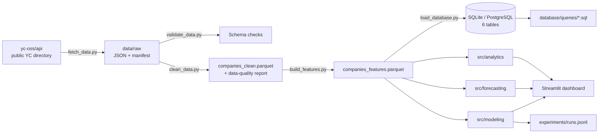

```
app/streamlit_app.py          Dashboard (9 tabs, sidebar filters, downloads)
src/
  config.py                   Paths and settings, overridable by environment variables
  pipeline.py                 Pipeline stage functions (fetch, validate, clean, features, load)
  run_models.py               Runs forecast backtests + status model, writes reports, logs experiments
  ingestion/fetch.py          Download raw data, retries, fallback URL, provenance manifest
  cleaning/                   validate.py, clean.py, quality.py
  features/build.py           Derived features, AI classification, batch completeness
  database/load.py            Normalised tables + loader (SQLite default, PostgreSQL via DATABASE_URL)
  analytics/core.py           Filters, KPIs, rates with confidence intervals, momentum, insights
  forecasting/models.py       Five forecasters, rolling-origin backtest, intervals
  modeling/status_model.py    Leakage-controlled classifier with temporal validation
  modeling/tracking.py        Append-only experiment log
scripts/                      Command-line entry points (run_pipeline, run_models, ...)
database/schema.sql           Relational schema
database/queries/*.sql        Five analytical SQL queries
data/raw, data/processed      Untouched source data; parquet + SQLite outputs
reports/                      Data-quality report, cleaning log, forecast and model results
experiments/runs.jsonl        Log of every forecast / model run
docs/images/                  Chart images used in this README
tests/                        50 pytest tests
.github/workflows/ci.yml      GitHub Actions: install + run tests
```

## 4. Dataset

| | |
|---|---|
| **Source** | [yc-oss/api](https://github.com/yc-oss/api): an unofficial, automatically updated JSON mirror of YC's public company directory |
| **Access** | Plain HTTPS download, no API key, no scraping. Primary URL is the raw GitHub file; the GitHub Pages endpoint is a fallback |
| **Provenance** | `data/raw/fetch_manifest.json` records URL, retrieval timestamp, byte size, record count and SHA-256 |
| **Size** | 6,260 companies, 51 batches (Summer 2005 to Summer 2027, including in-progress and upcoming batches) |
| **Licence note** | Factual public data; check yc-oss/api and ycombinator.com terms before redistributing |

**Fields available:** name, slug, website, one-liner, long description, batch, status (Active / Inactive / Acquired / Public), industry and subindustry, tags, free-text locations, regions, team size, launch timestamp, stage, hiring flag, nonprofit flag, top-company flag, YC page URL.

**Fields that do NOT exist** (so nothing here pretends they do): founder names or founder counts, status history over time, funding, revenue, valuation, exit dates. `team_size` is *current headcount*, not founders.

### Data dictionary (feature table, 41 columns)

| Group | Columns |
|---|---|
| Identity | `company_id`, `slug`, `name`, `website`, `yc_url` |
| Text | `one_liner`, `long_description`, `description_length` |
| Outcome | `status`, `is_operating` (Active or Public), `stage` |
| Classification | `industry`, `subindustry`, `tags`, `tag_count` |
| Batch | `batch`, `batch_season`, `batch_year`, `batch_code` (e.g. W12, X25), `batch_start` (approx.), `batch_order`, `batch_status` (complete / in_progress / future / unknown), `years_since_batch` |
| Team | `team_size`, `team_size_outlier`, `team_size_bucket`, `is_hiring`, `is_nonprofit`, `is_top_company` |
| Location | `all_locations`, `location_entries`, `primary_city`, `primary_region`, `primary_country`, `location_count`, `is_remote`, `regions` |
| AI (derived) | `ai_tag`, `ai_keyword`, `is_ai` |
| Dates | `launched_at` |

## 5. Data pipeline

Run everything with `python scripts/run_pipeline.py --offline` (or `--force` to redownload). Each stage reads the previous stage's file, so stages can run independently.

| Stage | Script | Module (inside `src/`) and functions | What it does |
|---|---|---|---|
| Fetch | `fetch_data.py` | `ingestion/fetch.py`: `fetch_raw`, `_get` | Downloads with retries and backoff, tries a fallback URL, saves the raw bytes untouched, writes a provenance manifest. Skips if data already exists |
| Validate | `validate_data.py` | `cleaning/validate.py`: `validate_raw` | Checks required fields exist, ids are unique, statuses are known. Errors stop the pipeline; warnings are logged |
| Clean | `clean_data.py` | `cleaning/clean.py`: `clean_companies`, `parse_batch`, `parse_location`, `split_locations`, `clean_text` | Normalises text, parses batches and locations, handles invalid values, logs every decision |
| Quality report | (part of clean) | `cleaning/quality.py`: `data_quality_report`, `write_quality_report` | Row/column counts, missing %, duplicates, unique counts, invalid counts, date ranges, dtypes to `reports/data_quality.json` and `.md` |
| Features | `build_features.py` | `features/build.py`: `build_features`, `is_ai_tag`, `is_ai_keyword`, `batch_status` | Adds AI flags, batch completeness, team-size buckets and other derived columns |
| Load DB | `load_database.py` | `database/load.py`: `build_tables`, `load_database` | Splits the wide table into normalised tables and loads them |

### Cleaning decisions (from `reports/cleaning_log.json`)

Nothing is dropped silently: every step is counted and explained.

| Step | Rows | Decision |
|---|---:|---|
| Duplicate company ids | 0 | Would keep the last record |
| Unknown status values | 0 | Would recode to `Unknown` |
| Industry "Unspecified" | 18 | Kept as its own category; excluded from industry rate charts |
| Batch not parseable (e.g. "Unspecified") | 1 | Season/year left null; row retained |
| `team_size` <= 0 (invalid, e.g. -1) | 134 | Set to null |
| `team_size` extreme outliers (> 3,038) | 13 | Flagged and retained; robust statistics (median) used |
| `team_size` missing after cleaning | 245 | Left null; **not imputed** |
| `launched_at` out of range | 0 | Would set to null |
| No physical location (blank or remote-only) | 197 | City/country left null; **not imputed** |
| Companies sharing a name | 191 rows | Kept: distinct ids and slugs mean different companies |

### Feature engineering

- **Location parsing:** `"San Francisco, CA, USA"` becomes city / region / country, with `USA` normalised to `United States`. The primary location is the first non-remote entry; remote is a separate flag.
- **Batch completeness:** each batch gets a status (`complete`, `in_progress`, `future`, `unknown`) relative to the data's retrieval date. Recent batches are excluded from time series by default, otherwise incomplete batches would look like a collapse.
- **AI classification (derived, transparent):** `ai_tag` = YC's own tags contain AI-related terms (regex on AI, artificial intelligence, machine learning, deep learning, computer vision, NLP, generative, LLM). `ai_keyword` = the same family of keywords appears in the one-liner or description. `is_ai` = either. The keyword layer was **not** audited for precision.
- **Team-size buckets:** 1, 2, 3-5, 6-10, 11-50, 51-200, 200+.

## 6. Database and SQL

SQLite by default (no server needed); PostgreSQL via the `DATABASE_URL` environment variable (untested). Only tables the data justifies exist: there is no founders table and no status-history table because the source has neither.

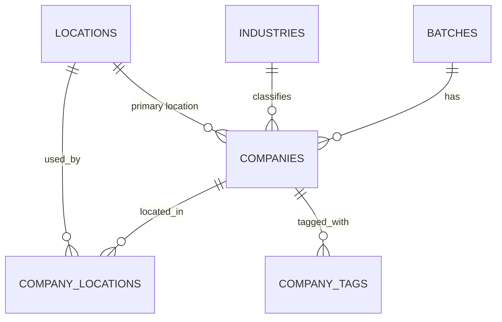

| Table | Rows | Purpose |
|---|---:|---|
| `batches` | 51 | Season, year, code, approximate start, completeness |
| `industries` | 59 | Industry + subindustry pairs |
| `locations` | 456 | Unique parsed places (city, region, country, remote flag) |
| `companies` | 6,260 | One row per company with foreign keys and flags |
| `company_locations` | 8,170 | Many-to-many, with an `is_primary` flag |
| `company_tags` | 16,311 | Many-to-many tags |

The schema uses primary keys, foreign keys, unique constraints and indexes. A test checks referential integrity and that each company has exactly one primary location.

### Analytical SQL queries (`database/queries/`)

| File | Question | Techniques |
|---|---|---|
| `01_batch_growth.sql` | How has the company count changed by year? | CTE, `GROUP BY`, `LAG()`, year-over-year %, rolling 3-year `AVG() OVER` |
| `02_industry_outcomes.sql` | Which industries have the highest operating / acquired / inactive rates? | Multi-table `JOIN`, conditional aggregation with `CASE`, `GROUP BY ... HAVING` |
| `03_country_concentration.sql` | How concentrated is the ecosystem by country? | CTE, `RANK()`, share of total via `SUM() OVER ()`, cumulative share |
| `04_ai_share_by_year.sql` | How has AI share changed under two definitions? | `JOIN`, `AVG` on 0/1 flags, `HAVING` |
| `05_industry_mix_cohorts.sql` | Which industries lead each batch-year cohort? | Chained CTEs, `SUM() OVER (PARTITION BY)`, `RANK() OVER (PARTITION BY)` |

Run one yourself:

```bash
python - <<'PY'
import sqlite3, pandas as pd
con = sqlite3.connect("data/processed/yc.db")
print(pd.read_sql(open("database/queries/02_industry_outcomes.sql").read(), con))
PY
```

`tests/test_sql_queries.py` runs every query against a database built from the real data and cross-checks two of them against pandas (company counts by year, and per-industry counts and operating rates).

## 7. Analytics layer

`src/analytics/core.py` holds pure functions (no Streamlit imports) so they are unit-tested and reusable.

| Function | Purpose |
|---|---|
| `Filters` (dataclass) | One immutable object describing every sidebar filter |
| `apply_filters(df, f)` | Applies year, industry, status, country, AI, team-size and batch-completeness filters |
| `ai_column(definition)` | Maps "broad" or "tag" to the right AI column |
| `kpis(d, ai_col)` | Total, operating %, acquired count, industries, countries, cities, AI share, median team size |
| `per_batch(d)` | Companies per batch in chronological order |
| `year_status(d)` | Companies per year by status |
| `top_counts(d, col, n)` | Top-N category counts |
| `crosstab_share(d, row, col, top_n, normalize)` | Percent matrices for the heatmaps |
| `wilson_ci(k, n)` | 95% Wilson score interval for a proportion |
| `rate_by_group(d, group, flag, min_n)` | Rate per group with confidence interval and a minimum-sample rule |
| `ai_share_by_year(d)` | AI share per year under both definitions |
| `momentum(d, level, window, min_recent)` | Industry Growth Momentum (see below) |
| `insights(d, ai_col)` | Generates the "Key insights" sentences from the current filter; nothing is hard-coded |

**Industry Growth Momentum** = a group's share of companies in the most recent *N* batch years minus its share in the *N* years before, in percentage points (with count growth % alongside, and a minimum-size threshold). It is descriptive only; it is not a forecast or a measure of future success.

## 8. Dashboard walkthrough

Start it with `streamlit run app/streamlit_app.py`. The header shows how many of the 6,260 companies match the current filters, plus dataset version and retrieval date.

### Sidebar controls

| Control | Effect |
|---|---|
| Include in-progress / future batches | Off by default; recent batches are incomplete |
| Batch year (range slider) | Restricts the batch years shown |
| Industry, Status, Country (multiselects) | Empty = all; country list is the 40 largest |
| AI definition (Broad or YC tags only) | Chooses which AI classification the app uses |
| AI filter (All / AI / Non-AI) | Restricts to AI or non-AI companies under that definition |
| Team size (range) + include unknown | Restricts by current headcount; unknown sizes can be kept or dropped |
| Top N (5-25) | Number of bars in the top-N charts |

The filters drive the analysis tabs (Overview to Explorer). **Forecasting and Predictive Model deliberately ignore them** and use all complete batches.

### KPI cards (always visible)

Companies, Operating % (Active + Public), AI share (depends on the chosen definition), Industries, Countries, Median team size (current headcount).

### Tab 1: Overview

- **Key insights box:** sentences generated live from the filtered data (largest batch, top industry, top country, operating and acquired share, AI share change).
- **Companies per batch** (bar, coloured by season): how batch sizes evolved; Winter 2022 is the largest at 398 companies. Note the cadence change from 2 to 4 batches per year in 2024-2025.
- **Companies per year by current status** (stacked bar).
- Download: batch counts CSV.


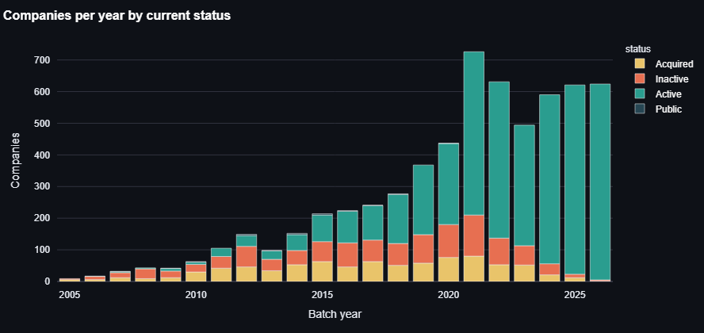

### Tab 2: Industries

Level switch (industry or subindustry), then:

- **Top groups** (horizontal bar): what YC funds most.
- **Group mix by batch year** (heatmap of % of each year's companies): read down a column to see one year's mix; across a row to see a group's trend.
- **Outcome rates with 95% Wilson intervals** (bar with error bars; choose Operating or Acquired; minimum group size slider): the intervals show which differences are real versus small-sample noise.
- **Industry Growth Momentum** (window and minimum-size sliders): diverging bar of share gainers and losers, plus a full table and CSV download.

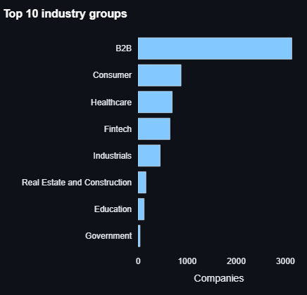
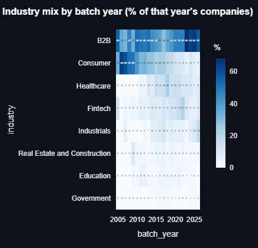
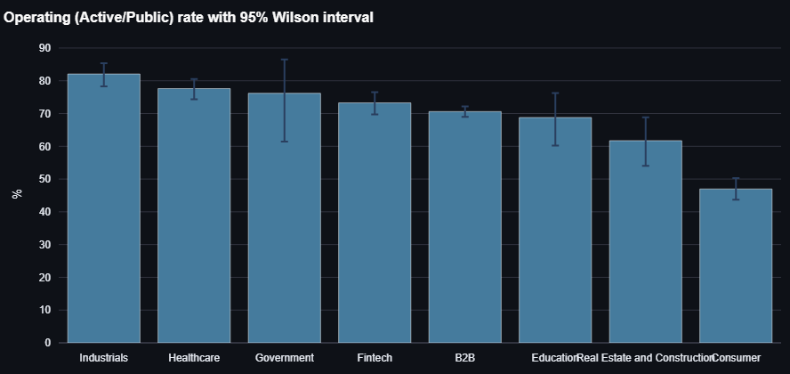
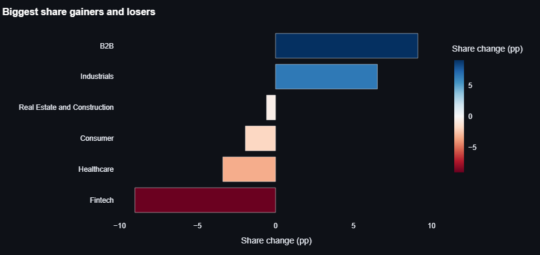

Caveat shown in the app: rates reflect *current* status and older cohorts have had longer to fail or be acquired, so compare groups within similar batch years. Not causal.

### Tab 3: Geography

- **Choropleth world map** (log colour scale, because the US dominates): interactive hover shows counts. *(Best viewed live; static snapshot not included.)*
- **Top countries** and **Top cities** (bars).
- **Industry mix within each country** (heatmap): shows what each country specialises in.
- A caption reports how many companies have no physical location and are excluded here. Download: country counts CSV.

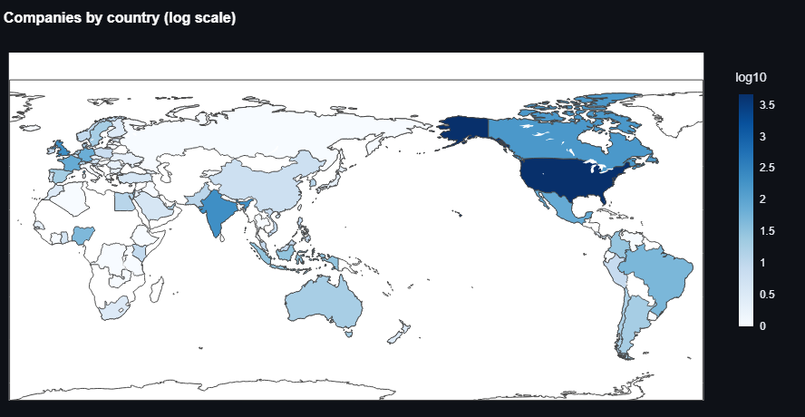
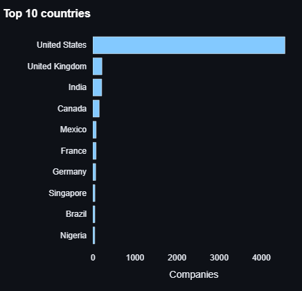
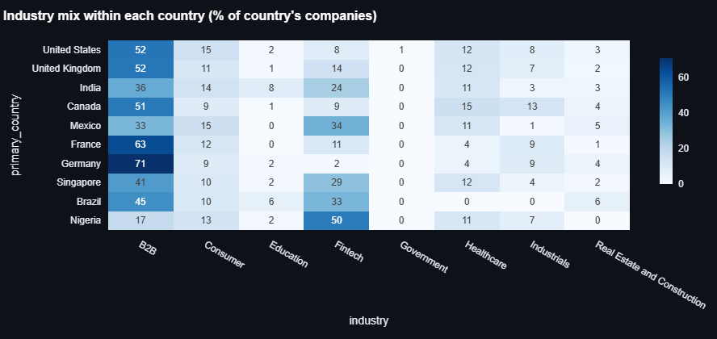

### Tab 4: AI

Labelled as a **derived classification**.

- **AI share by batch year** under both definitions (lines). The two diverge in the newest years; one possible explanation is that new companies are tagged late, but this has not been tested.
- **AI share by industry** and **most common tags among AI companies** (bars).
- Download: AI share by year CSV.

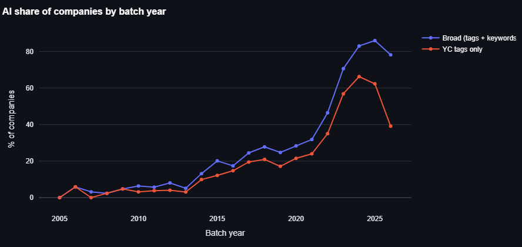
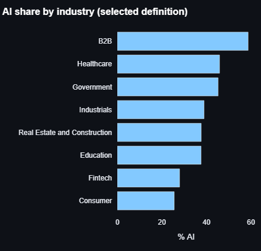
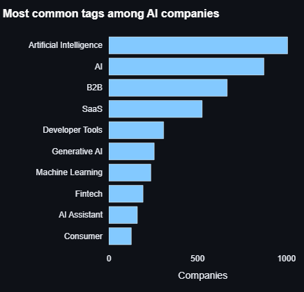

### Tab 5: Status and Team

- **Current status** (donut) and **status mix by batch year** (100% stacked bars), with a survivorship/cohort-age caveat.
- **Team-size distribution** (histogram, log scale) and **median team size by batch year** (line). Clearly labelled *current headcount, not founders*; unknown sizes are counted in a caption.

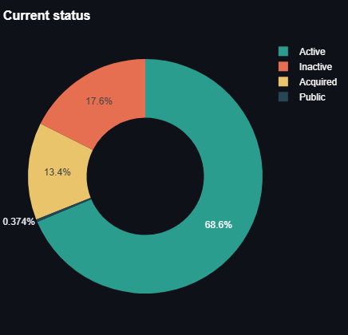
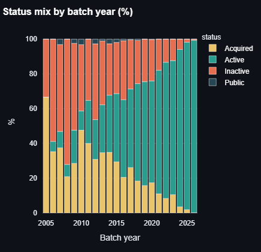
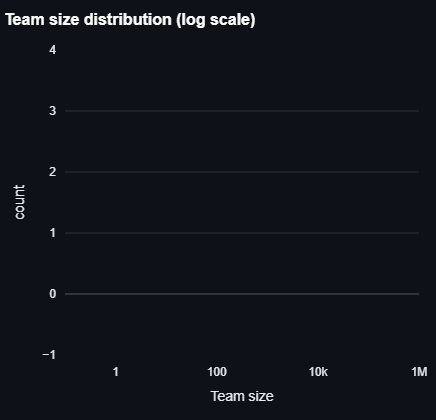
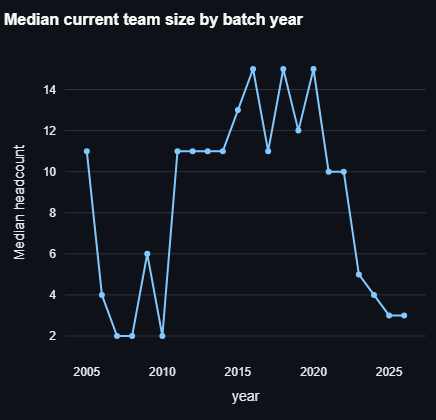

### Tab 6: Explorer

Search by name or one-liner; sortable table with clickable website and YC-page links; **download the filtered records as CSV**. Only public directory fields are shown.

### Tabs 7 and 8: Forecasting and Predictive Model

Described in the next two sections.

### Tab 9: Data and Method

Observed-versus-derived explanation, known limitations, the full cleaning log and dataset metadata (version hash, as-of date, source URL).

### Downloads available in the app

Batch counts, momentum table, country counts, AI share by year, filtered companies, forecast, forecast model comparison, model test-set predictions, and the experiment log (all CSV). Every Plotly chart also has a built-in toolbar to save it as an image.

## 9. Forecasting

**Target:** number of companies per batch year (all companies, AI broad, AI tags, and each industry with at least 100 companies).

**Series construction:** only years in which every batch is complete, starting 2006 (2005 had a single batch). The current, incomplete year is shown as a separate marker instead of being used for training.

**Models** (`src/forecasting/models.py`): naive (last value), 3-year moving average, simple exponential smoothing, damped-trend Holt, and ARIMA(1,1,0) with drift. Complex seasonal models (SARIMA, Prophet) are **not** used: annual data has no seasonality and only ~20 points.

**Evaluation:** rolling-origin (expanding-window) backtest. Starting after 8 years, each model forecasts the next year using only earlier years, giving 12 out-of-sample predictions. Data is never shuffled. Metrics:

- MAE = mean of |actual - forecast|
- RMSE = square root of the mean squared error
- MAPE = mean of |error| / actual, in %, over years with actual > 0
- `rmse_vs_naive` = model RMSE / naive RMSE (below 1 means better than naive)

**Prediction interval:** forecast ± z × backtest RMSE × √horizon, with z = 1.28 (80%) or 1.96 (95%), clipped at zero. It is an empirical approximation, not a model-based interval.

**Results:**

| Series | Best model | RMSE | Naive RMSE | Verdict |
|---|---|---:|---:|---|
| All companies | naive | 109.2 | 109.2 | No model beats naive |
| AI (broad, derived) | damped Holt | 41.3 | 59.9 | 31% lower error, on 12 backtest points |

The app shows a warning whenever no model clearly beats naive, and notes that the gain for AI is optimistic because the same backtest chose the model and set the interval.

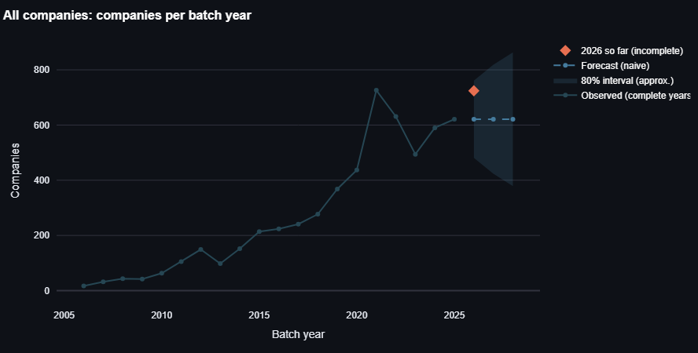
<!--

-->

**Controls in the tab:** series, horizon (1-5 years), interval level, model (or "best by backtest RMSE"). It also shows the full model-comparison table and downloads for the forecast and the comparison.

**Why annual company counts are a hard target:** they reflect YC's own decisions about batch size (including the 2024-2025 move from two to four batches a year) and may be undercounted for recent batches, because only publicly launched companies appear.

## 10. Predictive modelling

**Question:** using only information available at admission, can we predict which companies are currently *Inactive*?

**Target:** `Inactive` (1) versus Active, Public or Acquired (0). Acquired is not treated as a shutdown.

**Design choices that prevent misleading results:**

- **Right-censoring:** only complete batches 2006-2021 are used, because later batches have not had time to fail.
- **Temporal split:** train on 2006-2017 (1,380 companies, 35.7% inactive), test on 2018-2021 (1,808 companies, 21.7% inactive). The drop in the inactive rate is the censoring effect.
- **Forward-chaining cross-validation** on the training years (three folds where validation is always later than training). No random splits.
- **Leakage control:** team size, hiring, stage, top-company flag, launch date, tag count and description length are excluded because they are measured after the outcome. A test asserts none of them enter the feature list.
- **Features used:** batch season, batch year, industry, subindustry, country group (top 8 train countries, else Other, or Unknown), AI flag.
- **Imbalance handling:** class weights, plus PR-AUC alongside ROC-AUC.
- **Threshold:** chosen to maximise F1 on out-of-fold training predictions, then applied unchanged to the test set. The test set is used only for final reporting, never for model selection or threshold tuning.
- **Model choice:** by cross-validated PR-AUC only, never by test score.

**Models:** prior-probability baseline, logistic regression, decision tree (depth 4), random forest (300 trees), gradient boosting.

| Model | CV PR-AUC | Test ROC-AUC | Test PR-AUC | Precision | Recall | F1 |
|---|---:|---:|---:|---:|---:|---:|
| Baseline (prior) | 0.338 | 0.500 | 0.217 | 0.000 | 0.000 | 0.000 |
| **Logistic regression** (chosen by CV) | **0.472** | 0.625 | 0.319 | 0.244 | 0.885 | 0.382 |
| Decision tree | 0.397 | 0.620 | 0.300 | 0.227 | 0.941 | 0.366 |
| Random forest | 0.442 | 0.631 | 0.334 | 0.252 | 0.819 | 0.386 |
| Gradient boosting | 0.461 | 0.626 | 0.322 | 0.258 | 0.735 | 0.382 |

**Honest reading:** all models beat chance only modestly (test PR-AUC baseline is the 0.217 prevalence). At the F1-optimal threshold the chosen model flags 79% of test companies as inactive (348 true positives, 1,080 false positives, 45 false negatives, 335 true negatives). It has little practical value for picking failures, which is itself a useful finding: batch, industry and location alone say little about who shuts down.

**Interpretability:** permutation importance on the test set (drop in PR-AUC): country group 0.042, industry 0.042, AI flag 0.021, batch year 0.003, batch season ~0, subindustry slightly negative (no usable signal). This shows what the model *relies on*, not what *causes* shutdown. SHAP is not used.

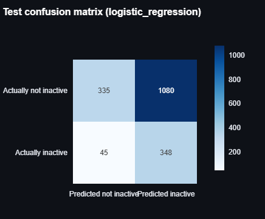
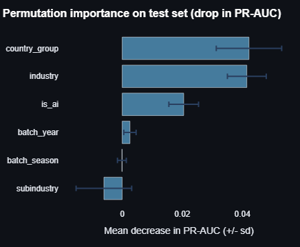

**Remaining leakage risk:** industry, AI flag and country are current snapshots and may have been updated after a company changed direction.

## 11. Experiment tracking

`src/modeling/tracking.py` appends one JSON record per run to `experiments/runs.jsonl`: experiment id, UTC timestamp, kind (forecast or classification), dataset version (hash of the raw file), model, parameters, features, metrics and notes. `load_runs()` returns a flat table. The Predictive Model tab shows the log and offers a CSV download. Each `run_models.py` execution adds 55 records (10 forecast series x 5 models + 5 classifiers).

## 12. Testing and engineering quality

50 pytest tests; the CI workflow runs them all on every push.

| File | Tests | What it covers |
|---|---:|---|
| `test_cleaning.py` | 10 | Batch and location parsing, duplicate handling, invalid team sizes, outlier flagging, status normalisation, validation |
| `test_features.py` | 3 | AI tag and keyword rules (including false-positive guards), batch completeness, feature columns |
| `test_database.py` | 2 | Referential integrity, one primary location per company, unique keys |
| `test_analytics.py` | 9 | Filters, Wilson interval properties, KPIs, crosstab sums to 100, momentum, insights |
| `test_forecasting.py` | 7 | No look-ahead in the backtest (spy test), metrics, interval widening and clipping, failure handling, series construction |
| `test_modeling.py` | 6 | Leakage guard, censored cohorts excluded, strictly temporal folds, determinism, tracker |
| `test_sql_queries.py` | 9 | Every SQL file runs and returns rows; results cross-checked against pandas |
| `test_app.py` | 4 | The whole app renders headlessly, filters change results, empty filters do not crash, forecast controls respond |

Practices used: modular code with type hints and docstrings, central configuration with environment overrides, logging, deterministic random seeds (default 42), input validation, Streamlit caching (`st.cache_data`) for data loading and backtests, idempotent database loading, and a raw-to-clean-to-features layout so every stage is reproducible from the raw file.

## 13. Skills demonstrated

### Data analyst skills

| Skill | Evidence in this repo |
|---|---|
| SQL | `database/queries/`: CTEs, window functions (`LAG`, `RANK`, `SUM OVER PARTITION`), `CASE`, `HAVING`, multi-table joins; validated against pandas |
| Data cleaning and quality | `src/cleaning/`; counted, documented decisions; no silent drops; quality report |
| Data modelling | Normalised relational schema with keys and indexes; justified by what the data supports |
| Exploratory and business analysis | KPI definitions, cohort views, share and growth analysis, generated insights |
| Data visualisation | 20 interactive Plotly charts (bars, stacked, heatmaps, lines, donut, choropleth, error bars, diverging bars) |
| Dashboarding and UX | Streamlit app with filters, tabs, KPI cards, captions that state what to conclude and what not to |
| Statistical thinking | Wilson confidence intervals, minimum-sample rules, robust statistics, survivorship and censoring awareness |
| Communication | Findings computed from data, explicit limitations, observed vs derived labelling |

### Data science skills

| Skill | Evidence in this repo |
|---|---|
| Feature engineering | Location parsing, batch completeness, transparent rule-based AI classification |
| Time-series forecasting | Five models, rolling-origin backtest, interval estimation, comparison to a naive benchmark |
| Supervised learning | Logistic regression, tree, random forest, gradient boosting, imbalanced classification |
| Sound validation | Temporal split, forward-chaining CV, no random shuffling; test set used only for final reporting, never for model selection or threshold tuning |
| Leakage and bias control | Excluded post-outcome features, right-censoring handled, tested by assertion |
| Evaluation | ROC-AUC, PR-AUC, precision, recall, F1, confusion matrix, threshold chosen out-of-sample |
| Interpretability | Permutation importance with clear non-causal framing |
| Experiment tracking and reproducibility | JSONL experiment log, dataset hash, fixed seeds, deterministic-run test |
| Scientific honesty | Negative results reported as findings; warnings in the UI when models do not beat baselines |

### Engineering skills

Modular Python project structure, unit and integration testing, GitHub Actions CI, environment-based configuration, logging, caching and performance, cloud deployment.

## 14. Technology stack

| Area | Tools |
|---|---|
| Language | Python 3.10+, SQL |
| Data | pandas, NumPy, PyArrow (Parquet) |
| Database | SQLite (default), PostgreSQL support via SQLAlchemy 2.x |
| Statistics and time series | statsmodels (exponential smoothing, ARIMA); SciPy is installed as a dependency |
| Machine learning | scikit-learn (pipelines, one-hot encoding, logistic regression, trees, forests, histogram gradient boosting, permutation importance) |
| Visualisation | Plotly (interactive charts) |
| App | Streamlit |
| Testing and CI | pytest, Streamlit `AppTest`, GitHub Actions |
| Ingestion | requests (with retries and a fallback source) |
| Docs tooling (dev only) | kaleido (static chart images) |
| Deployment | GitHub, Streamlit Community Cloud |

## 15. Methodology and statistical concepts

| Concept | Where and why |
|---|---|
| Observed vs calculated vs estimated vs derived | Labelling throughout, so readers know what is a fact and what is a construct |
| Wilson score interval | Rates by group; better than the normal approximation for small groups and extreme proportions |
| IQR fence on a log scale | Flags extreme team sizes without deleting them |
| Right-censoring / cohort age | Why the model only uses batches 2006-2021 and why status by year is not a fair comparison |
| Survivorship and selection bias | Only publicly launched companies appear; inactive companies may be missing |
| Rolling-origin evaluation | Honest time-series testing; each forecast uses only the past |
| Naive benchmark | Any forecast must beat "same as last year" to be worth using |
| PR-AUC vs ROC-AUC | PR-AUC is more informative when the positive class is a minority |
| Forward-chaining CV | Cross-validation that respects time order |
| Permutation importance | Model-agnostic measure of reliance on each feature |
| Correlation is not causation | Stated wherever rates, importance or trends are shown |

## 16. Limitations and responsible analytics

- Only publicly launched YC companies are included; recent batches may be undercounted (selection bias).
- Status is one current snapshot: no history, and "Acquired" does not mean "successful".
- No founder, funding or revenue data exists in the source.
- The AI keyword layer has not been audited for precision; descriptions are current, so companies that later pivoted to AI are labelled AI for earlier batches.
- Batch start dates are approximations used for ordering and completeness only.
- Forecasts use about 20 annual points; intervals are approximate.
- The status model is weak; do not use it to judge individual companies.
- All comparisons are descriptive; nothing here is causal.
- The data is a snapshot from the retrieval date; refreshing changes the numbers.

## 17. Run locally

Requires Python 3.10 or newer. The data is already included.

```bash
git clone https://github.com/YOUR-USERNAME/yc-startup-intelligence.git
cd yc-startup-intelligence

python -m venv .venv
source .venv/bin/activate          # Windows: .venv\Scripts\activate
pip install -r requirements.txt

streamlit run app/streamlit_app.py     # opens http://localhost:8501
```

Rebuild everything from raw data (optional):

```bash
python scripts/run_pipeline.py --offline   # validate, clean, features, database
python scripts/run_models.py               # forecasts + status model + experiment log
python -m pytest -q                        # 50 tests
```

Download fresh data instead of using the included copy: `python scripts/run_pipeline.py --force` (needs internet). Individual stages: `fetch_data.py`, `validate_data.py`, `clean_data.py`, `build_features.py`, `load_database.py` in `scripts/`.

Regenerate the README chart images (needs internet for the map): `pip install -r requirements-docs.txt && python scripts/make_readme_images.py`.

## Deployment

### Step 0: replace the placeholders

```bash
grep -rn "YOUR" README.md LICENSE
```
Replace `YOUR-USERNAME` (GitHub username), `YOUR-APP` (Streamlit app name, chosen in Step 2), `YOUR-PROFILE` (LinkedIn) and `YOUR NAME` (LICENSE and author).

### Step 1: publish the code on GitHub

1. Create an empty **public** repository named `yc-startup-intelligence` on GitHub (no README or licence; they already exist here).
2. From the project folder:

```bash
git init
git add .
git commit -m "YC Startup Intelligence: pipeline, dashboard, forecasting, ML"
git branch -M main
git remote add origin https://github.com/YOUR-USERNAME/yc-startup-intelligence.git
git push -u origin main
```

3. Confirm these files were pushed, because the deployed app needs them: `data/processed/companies_features.parquet`, `data/processed/dataset_meta.json`, `reports/` and `experiments/`. (The SQLite file is git-ignored on purpose; the app does not use it.) Total repo size is about 25 MB.
4. Open the **Actions** tab: the CI workflow runs the tests on each push. It is unverified until its first run on GitHub, so check that it turns green.
5. On the repo page, click the gear next to **About** and add a one-line description, your live URL and topics such as `data-analysis`, `data-science`, `streamlit`, `plotly`, `forecasting`, `machine-learning`, `sql`, `python`.

### Step 2: deploy on Streamlit Community Cloud (free)

1. Go to https://share.streamlit.io and sign in with GitHub, granting access to the repository.
2. Click **Create app** (or **New app**), choose **Deploy a public app from GitHub**.
3. Set: Repository `YOUR-USERNAME/yc-startup-intelligence`, Branch `main`, **Main file path `app/streamlit_app.py`**.
4. Open **Advanced settings** and choose Python **3.12** (3.10 or newer works). No secrets are needed.
5. Choose an app URL (this becomes `YOUR-APP` in `https://YOUR-APP.streamlit.app`) and click **Deploy**. The first build installs `requirements.txt` and takes a few minutes; logs are visible in the app's **Manage app** panel.

Menu names on Streamlit's site change over time; if something differs, the [Streamlit deployment docs](https://docs.streamlit.io/deploy/streamlit-community-cloud) are authoritative.

### Step 3: finish the launch

- Paste the live URL into the two `YOUR-APP` spots in this README, commit and push (the app redeploys automatically on every push).
- Take real screenshots of the live app (especially the Geography map) and save them in `docs/images/`, then add them to the README. Or run the image script on a machine with internet to render the map: it will create `docs/images/07_geo_map.png`.
- Pin the repository on your GitHub profile and add the live link to your resume and LinkedIn.
- Free Streamlit apps go to sleep after a period of inactivity; the first visitor after that sees a "wake up" button. Open the app before sharing it in an interview.

### Refreshing the data later

```bash
python scripts/run_pipeline.py --force
python scripts/run_models.py
python -m pytest -q
git add data reports experiments && git commit -m "Refresh data" && git push
```

### Alternatives to Streamlit Cloud

Any host that can run Python works with: `streamlit run app/streamlit_app.py --server.port $PORT --server.address 0.0.0.0` (for example Render, Railway or your own server). A Dockerfile is not included yet.

### Troubleshooting

| Symptom | Fix |
|---|---|
| "Processed data not found" in the app | The parquet files were not pushed; commit `data/processed/` and redeploy |
| Build fails on a package | Check the Manage app logs; try Python 3.12 in Advanced settings |
| Tests skip or fail in CI | They need `data/processed/companies_features.parquet` in the repo |
| Map does not appear | It loads map data from a CDN; check the browser's network access |
| Numbers differ from this README | You refreshed the data; the source updates daily |

## 19. Resume and LinkedIn bullets

Only figures measured in this project are used.

Use the word "deployed" only once your live app is running.

**Resume (one entry):**
> **YC Startup Intelligence Platform** | Python, SQL, pandas, scikit-learn, statsmodels, Plotly, Streamlit
> - Built an end-to-end analytics platform on 6,260 Y Combinator companies: reproducible ingestion, validation and cleaning pipeline (with a logged decision for every data issue), a normalised 6-table SQL database and 5 analytical SQL queries using CTEs and window functions.
> - Developed a 9-tab interactive Streamlit dashboard with 20 Plotly charts, dynamic filters, confidence-interval outcome rates, an "Industry Growth Momentum" metric and CSV exports; deployed publicly.
> - Implemented time-series forecasting with rolling-origin backtesting across 5 models and 10 series, showing that most series do not beat a naive baseline while AI-company counts do (31% lower RMSE).
> - Built a leakage-controlled status classifier (temporal split, forward-chaining CV, PR-AUC, permutation importance) and reported its weak discrimination (~0.63 test ROC-AUC) instead of overstating results.
> - Wrote 50 automated tests and a GitHub Actions CI workflow; added experiment tracking (JSONL log with dataset hash and parameters).

**LinkedIn summary sentence:**
> Built and deployed a full-stack analytics and data-science project on Y Combinator data, covering SQL, data cleaning, dashboards, forecasting and machine learning, with an emphasis on honest validation and clearly stated limitations.

## 20. Roadmap

Not built yet, and stated plainly:

- Statistical hypothesis tests (chi-square with effect sizes) inside the app
- Clustering and segmentation of companies
- A downloadable PDF/HTML analytical report and a question-explorer page
- Dockerfile and docker-compose
- SHAP explanations
- Auditing the AI keyword layer with a labelled sample
- Text-based features (embeddings) for the status model

## 21. Author, licence, acknowledgements

**Author:** YOUR NAME | [LinkedIn](https://www.linkedin.com/in/YOUR-PROFILE) | [GitHub](https://github.com/YOUR-USERNAME)

**Licence:** MIT for the code (see `LICENSE`). The company data is factual public data from YC's directory; check the terms of yc-oss/api and ycombinator.com before redistributing it.

**Acknowledgements:** the maintainers of [yc-oss/api](https://github.com/yc-oss/api) for the open data mirror; Y Combinator for publishing the company directory. This project is independent and not endorsed by Y Combinator.

streamlit run app/streamlit_app.py
